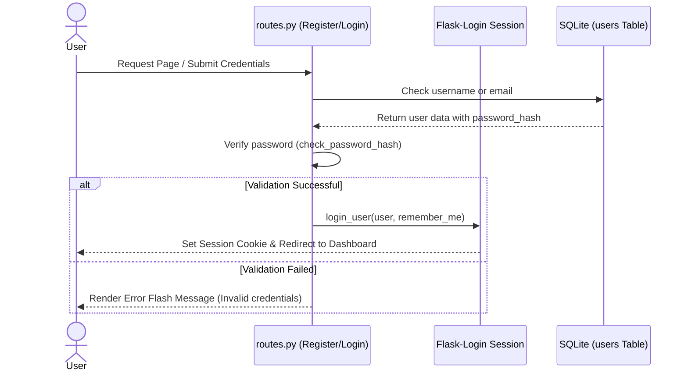
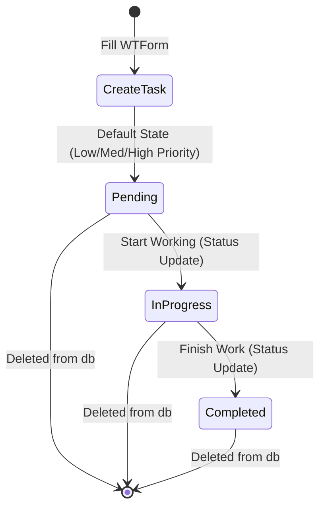
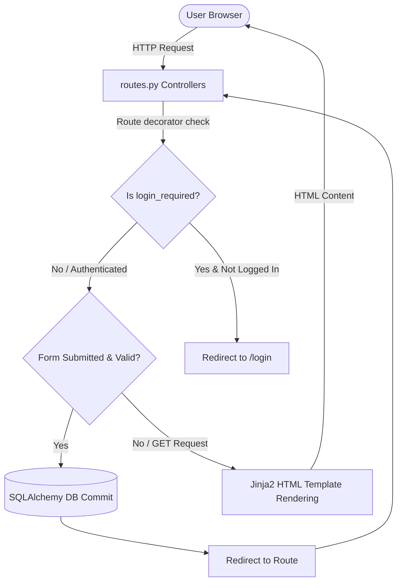

# 📋 TaskMaster - Full Stack Task Management System

TaskMaster is a modern, production-ready **Full Stack Task Management Web Application** built with **Python and Flask**.

It provides secure authentication, task management, analytics dashboard, advanced search/filtering, pagination, calendar tracking, and a responsive user interface designed with clean UI/UX principles.

---

# 🚀 Features

## 🔐 Authentication & Security

- Secure user registration and login
- Session management using Flask-Login
- Password hashing using Werkzeug
- CSRF protection using Flask-WTF
- Protected routes with authentication middleware
- Profile management
- Secure password updates

---

# 📊 Dashboard & Analytics

TaskMaster provides a personalized dashboard with:

- Total task count
- Completed task statistics
- Pending task statistics
- In-progress task tracking
- High-priority task monitoring
- Recent tasks overview
- Upcoming tasks sorted by due date
- Task completion percentage visualization

---

# 📝 Task Management (CRUD)

Users can completely manage their tasks:

### Create
- Add new tasks
- Set title and description
- Assign due dates
- Select priority levels
- Select task status

### Read
- View all tasks
- View task details
- Track progress

### Update
- Edit task information
- Change status
- Update priority

### Delete
- Remove unwanted tasks

---

## Task Attributes

### Priority
- **Low**
- **Medium**
- **High**

### Status
- **Pending**
- **In Progress**
- **Completed**

---

# 🔍 Advanced Search & Filtering

TaskMaster supports:

- Dynamic search by title or description
- Status filtering
- Priority filtering
- Sorting by due date (ascending & descending)
- Sorting by creation date
- Server-side pagination (5 tasks per page)

---

# 📅 Calendar View

The calendar module provides:

- Task timeline visualization
- Due date tracking
- Priority display
- Status monitoring

---

# 🛠️ Technology Stack

| Category | Technology |
|---|---|
| Backend | Python 3.11+, Flask (3.0.3) |
| Database | SQLite |
| ORM | Flask-SQLAlchemy (3.1.1) |
| Authentication | Flask-Login (0.6.3) |
| Forms | Flask-WTF (1.2.1) |
| Migration | Flask-Migrate (4.0.7) |
| Frontend | HTML5, CSS3 (Custom Styling & Animations) |
| UI Framework | Bootstrap 5 |

---

# 📂 Project Structure

```text
TaskMaster/
│
├── app.py              # Main application entry point
├── config.py           # Configuration configurations (Database & CSRF secret key)
├── requirements.txt    # Application dependencies
├── seed_db.py          # Script to generate mock tasks
├── clear_tasks.py      # Script to wipe all tasks
│
├── migrations/         # Database migrations folder
│
└── taskmaster/         # Main package directory
    ├── __init__.py     # App initialization & extension configuration
    ├── forms.py        # WTF form classes for registration, login, profile, and tasks
    ├── models.py       # SQLite database models for User and Task tables
    ├── routes.py       # Flask endpoints & routing rules
    │
    ├── static/         # Dynamic frontend assets
    │   ├── css/
    │   │   ├── style.css     # Main layout style rules
    │   │   └── landing.css   # Clean styles for index page
    │   │
    │   └── js/
    │       └── script.js     # Helper JavaScript files
    │
    └── templates/      # Jinja2 HTML templates
        ├── base.html
        ├── index.html
        ├── dashboard.html
        ├── tasks.html
        ├── calendar.html
        ├── create_task.html
        ├── edit_task.html
        ├── login.html
        ├── register.html
        ├── profile.html
        ├── settings.html
        ├── 404.html
        └── 500.html
```

---

# ⚙️ Installation & Setup

## 1. Clone Repository
```bash
git clone <repository-url>
cd TaskMaster
```

## 2. Create Virtual Environment

**Windows:**
```cmd
python -m venv venv
venv\Scripts\activate
```

**Linux / macOS:**
```bash
python3 -m venv venv
source venv/bin/activate
```

## 3. Install Dependencies
```bash
pip install -r requirements.txt
```

## 4. Database Setup
Initialize database migrations:
```bash
flask db upgrade
```
*For a fresh database setup:*
```bash
flask db init
flask db migrate -m "Initial migration"
flask db upgrade
```

## 5. Seed Database (Optional)
Create sample mock data (60 tasks under user `testuser` with password `password123`):
```bash
python3 seed_db.py
```
Clear tasks database:
```bash
python3 clear_tasks.py
```

## 6. Running Application
Start Flask server:
```bash
python3 app.py
```
*Note: If port 5000 is occupied, you can launch using a custom port:*
```bash
flask run --port 8000 --debug
```

Open browser at:
**[http://127.0.0.1:5000](http://127.0.0.1:5000)** (or **http://127.0.0.1:8000** if using custom port)

---

# 🏗️ Application Architecture

### 🔐 Authentication Flow


### 📝 Task Lifecycle Flow


### 🔄 Request Flow


---

# 🛡️ Security Features

Implemented security measures:
- **Password Hashing:** Uses `pbkdf2:sha256` hashing (via `Werkzeug`) to secure user passwords in the database.
- **CSRF Token Validation:** Validates request authenticity on all form submissions automatically using `Flask-WTF` tokens.
- **Authentication Middleware:** Blocks unauthenticated access to private resources using `@login_required` decorators.
- **Protected Routes:** Endpoints for Tasks, Profiles, Settings, and Calendar require valid sessions.
- **Secure Sessions:** Sessions are stored cryptographically secure using configured `SECRET_KEY`.
- **Input Validation:** Restricts field length, formats emails, and validates passwords on backend using `wtforms.validators`.

---

# 🚀 Future Enhancements

Possible improvements:
- REST API development with JWT authentication
- Email reminders for upcoming due dates
- Real-time task update notifications via WebSockets
- Role-based permissions (Admins, Managers, Members)
- Docker containerization for easier development and deployment
- Cloud database integration (PostgreSQL/MySQL)
- Companion Mobile application built with React Native or Flutter

---

# 🤝 Contribution

Steps to contribute:
1. Fork the repository
2. Create a feature branch:
   ```bash
   git checkout -b feature-name
   ```
3. Commit changes:
   ```bash
   git commit -m "Add feature description"
   ```
4. Push to branch:
   ```bash
   git push origin feature-name
   ```
5. Open a Pull Request

---

# 👨‍💻 Author

**Krushil Lukhi**
*Python Developer | Flask Developer | Full Stack Developer*
